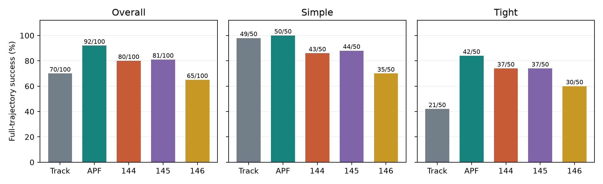

# Panda obstacle-aware posture control

[简体中文](README.md) | **English**

Learning Obstacle-Aware Posture Control for a Redundant Robotic Arm.

This project asks whether learned secondary posture control improves full-trajectory tracking near an obstacle when every controller shares the same analytic primary tracker, actuator limits, reference clock and success criteria. It compares tracker-only, a validation-tuned artificial potential field (APF), and three independently trained PPO policies.

**The frozen study does not support PPO outperforming the tuned APF under this budget and witness-filtered distribution.** All 500 test episodes, including failures, are retained. Each PPO seed completed 98,304 policy steps; this is not a convergence claim.

**Current distribution: v1.2.0.** It adds startup checks, automatic relocation across entry points, inspected native-GUI labels and a bounded learning-rate diagnostic. The reviewed 10-page report, 52-second annotated video and original models/test study remain unchanged. Individual reflections and other actual participants' independent reports still require their own review; nothing was submitted to a course platform. Historical reports and earlier releases remain available.

## Online reading and complete reproduction

| Goal | Entry point | Full ZIP required |
| --- | --- | --- |
| Read methods and results | [English report, 10 pages](deliverables/final_20261009/report_en_v2/final_report_en.pdf), [Chinese interpretation](deliverables/final_20261009/interpretation_zh.md), [failure analysis](docs/failure_analysis.md) | No |
| Inspect code | [Shared control](src/panda_posture/control.py), [whole-arm APF](src/panda_posture/secondary.py), [environment](src/panda_posture/env.py), [tests](tests/) | No |
| Watch the demonstration | [52-second video](deliverables/final_20261009/videos/final_demo_en_v2.mp4) | No |
| Inspect checkpoints, witnesses and all trajectories | [v1.2.0 Release assets](https://github.com/kimzclandi/panda-obstacle-aware-posture-control/releases/tag/v1.2.0) | Yes |
| Validate pretrained models or rerun the fixed 500 episodes | [Relocation and reproduction guide](docs/reproduction.md) | Yes; verify checksums and relocate the freeze first |

Download **`Panda_Posture_Control_v1.2.0.zip`**, not GitHub's automatically generated **Source code (zip/tar.gz)**. Each archive's own receipt and manifest bind its contents and code provenance; do not substitute a later commit into an earlier receipt. Download `SHA256SUMS` and its listed attachments into the same directory, then run:

```bash
shasum -a 256 -c SHA256SUMS
unzip Panda_Posture_Control_v1.2.0.zip
cd panda-posture
```

A missing attachment causes a checksum-check failure; it is not a verified download. A normal Git clone contains code, configurations, documentation, the report and video, but excludes `experiments/`, pretrained models and frozen installation metadata. Paths under `experiments/` below are **paths inside the full ZIP**, relative to its `panda-posture/` directory, rather than GitHub file links. Later documentation changes do not change the frozen scientific inputs.

For source inspection and tests that do not require frozen assets:

```bash
git clone https://github.com/kimzclandi/panda-obstacle-aware-posture-control.git
cd panda-obstacle-aware-posture-control
```

## Checks without training or scientific dependencies

These checks use only Python's standard library. They require neither PyBullet/PyTorch nor training:

```bash
python3 .github/scripts/check_readmes.py
python3 -m unittest discover -s tests -p test_release_archive.py -v
```

The [read-only archive checker](scripts/verify_release_archive.py) has been exercised on the **historical v1.0.0 complete archive**. Follow the [version-specific command](docs/reproduction.md#legacy-archive-check) with that release's ZIP, receipt and checksum files. Its old-archive validation does not validate later archives by this checker. Historical v1.1.0 publication and Linux extraction/run records are linked from its [release verification record](docs/github_sync_20261009.json); v1.2.0 has its own [recorded engineering summary](deliverables/updates_v1.2.0/verification_summary.json).

The checker does not access the network, extract files, execute archived code or load models. It checks download SHA-256, every member's CRC and manifest SHA-256, index/freeze/evaluation references and concrete README archive paths. The historical archive intentionally excludes `.venv/`: **30 PyBullet dependency assets remain unchecked** until installation of the locked environment and the original freeze validation. Archive integrity is not physical reproduction or model execution. The full `run_tests.sh` suite includes a small PPO learning smoke test and is separate from these no-training checks.

## Results and scope

| Same 100 held-out scenarios | Tracker | Tuned APF | PPO 144 | PPO 145 | PPO 146 |
| --- | ---: | ---: | ---: | ---: | ---: |
| Successful full trajectories | 70 | **92** | 80 | 81 | 65 |



The set contains 50 simple and 50 tight scenarios. Stratified results, paired intervals, conditionally compared continuous metrics and seed variability are recorded in the complete ZIP at `experiments/20261003T201319.444915Z_paired_evaluation/analysis/summary.json`. The video contains two real physical replays; all six panes reproduced joint states exactly in the recorded validation. Its 1,560 frames at 30 fps illustrate behavior and do not replace the 500-episode evidence.

The robot is a fixed-base Franka Panda with seven controlled arm joints and two finger targets of 0.02 m each. The task follows a short 3D straight-line position trajectory with a four-second quintic timing law near one known static sphere. Secondary control cannot change the reference path or timing, or pause the clock. Orientation control, vision, grasping, hardware, ROS and distributed training are outside the study.

Success requires position tolerance, collision and joint-limit checks to pass at initialization and after **every physics step**, throughout the trajectory. Tracking failure is permanently latched; later recovery cannot restore success. Collision, limit and numerical failures terminate the episode; tracking error does not pause time. Failed episodes stay in the denominator. Continuous metrics on mutually completed scenarios report their conditional sample counts. Checks at 240 Hz do not establish continuous-time safety between samples.

See the [project specification](docs/project_spec.md), [implementation decisions](docs/decisions.md) and [progress record](docs/progress.md). Detailed development documents retain their original Chinese language.

## Environment and source checks

The recorded reference environment is **Linux, CPython 3.11.17, CPU PyTorch and PyBullet DIRECT**. An earlier Python 3.12 PyBullet binary-install probe failed, so the project uses a private interpreter and virtual environment. The [lock file](requirements.lock.txt) records 35 external packages.

```bash
bash scripts/bootstrap.sh
env -u PYTHONPATH .venv/bin/python scripts/check_environment.py
bash scripts/run_tests.sh -q
env -u PYTHONPATH .venv/bin/python -m panda_posture.evaluate --diagnostics
```

Bootstrap obtains ordinary packages from PyPI and the CPU Torch wheel from its dedicated `find-links` source. It preserves and audits the five frozen `src/panda_posture.egg-info/` files when the full archive's freeze manifest is present. Do not remove these metadata files from a reproduction package. Clear host ROS `PYTHONPATH`; a GPU driver does not imply that the simulation or small PPO model uses CUDA. The reference installation and same-host relocation were validated on Linux; macOS, Windows, GPU execution and cross-hardware bitwise identity are not established by that evidence.

The basic test suite includes a small PPO save/load learning smoke test; it is separate from the 98,304-step study. The documentation workflow checks local navigation and synthetic archive contracts, not physics, model quality or experimental reproduction. Run its dependency-free check with `python .github/scripts/check_readmes.py`.

## Frozen inputs and experimental choices

The [study protocol](configs/study_protocol_v1.json) was declared before generating study data, training and comparing test results. [Shared physics settings](configs/study_base.json) apply to all policies.

| Input or stage | Frozen evidence inside the complete ZIP |
| --- | --- |
| Train 64 / validation 24, half simple and half tight in each split | `experiments/20261003T194210.629028Z_study_scenes/scenes.json` and its `post_generation_audit.json` |
| Test 100, independent generation seed 4490 | `experiments/20261003T194217.720814Z_study_scenes/scenes.json` |
| Model/input freeze and witness audit | `experiments/study_pretest_freeze.json` |
| APF selection, 12 candidates × 24 validation episodes | `experiments/20261003T195747.519524Z_potential_validation_tuning/selected.json` |
| PPO seed 144, selected at 61,440 steps; independent validation 19/24 | `experiments/20261003T195813.023303Z_ppo_study_seed144/training_summary.json` |
| PPO seed 145, selected at 12,288 steps; independent validation 17/24 | `experiments/20261003T195813.017181Z_ppo_study_seed145/training_summary.json` |
| PPO seed 146, selected at 49,152 steps; independent validation 18/24 | `experiments/20261003T195813.082516Z_ppo_study_seed146/training_summary.json` |

The APF selected on validation succeeded on 23/24 validation scenarios (12/12 simple, 11/12 tight), using `obstacle_gain=.0001`, `influence_distance=.08 m`, and `self_gain=0`. Disabling the self-collision potential term does not disable collision checks. The finite grid is not a claim of globally optimal classical control; see [potential-field details](docs/potential_field.md).

The three PPO learners ran concurrently on one CPU, each with one Torch/BLAS thread and its own seed, checkpoint and logs. Learning wall times including callback validation were 808.387, 780.717 and 807.257 seconds; throughput excluding those callbacks was approximately 176–177 policy steps/s. Actual concurrent elapsed time was approximately 14 minutes, not the sum of three individual durations. This was not distributed PPO or a CUDA speedup experiment. Training used train/validation only; observation normalization did not update from test data.

## Validate existing models without retraining

After extracting the **v1.2.0 full archive**, run its automatic entry point:

```bash
bash scripts/bootstrap.sh
env -u PYTHONPATH OMP_NUM_THREADS=1 OPENBLAS_NUM_THREADS=1 .venv/bin/python scripts/quickstart.py
```

It verifies the frozen inputs, creates a new relocation manifest when needed and runs the three selected models on the same fixed validation scene. Each must complete 960 physics steps. The v1.2.0 GUI and fixed-test entry points also prepare relocated paths automatically; explicit `--freeze` remains available for diagnostics. The v1.1.0 archive still needs the path printed by quickstart for its older GUI. This is a functionality check, not another 500-episode study. The [reproduction guide](docs/reproduction.md) retains the explicit diagnostic steps. Original configurations and frozen records must remain byte-identical. Relocation maps identical files to new paths, validates hashes and preserves the parent manifest; it cannot waive an input mismatch.

The historical v1.1.0 release (750,132,146 bytes) was extracted into a new directory on the same Linux host: 6,434 manifest files were checked, and each selected model completed 960 physics steps with bitwise-identical states and commands. See the [saved extraction verification](https://github.com/kimzclandi/panda-obstacle-aware-posture-control/releases/download/v1.1.0/Panda_Final_Project_20261009.verification.json). This does not claim validation on another machine or platform.

```bash
# After relocation; use the actual new manifest created by the guide.
env -u PYTHONPATH .venv/bin/python scripts/validate_delivery.py \
  --index study_index.json \
  --freeze experiments/reproduction_01/relocated_freeze.json

# Optional fixed 500-episode reevaluation of existing models; no training.
env -u PYTHONPATH OMP_NUM_THREADS=1 OPENBLAS_NUM_THREADS=1 .venv/bin/python \
  scripts/run_frozen_test.py --index study_index.json \
  --freeze experiments/reproduction_01/relocated_freeze.json
```

These commands create new result directories and retain failures. The quick delivery check uses one fixed validation scenario for all three selected models; it is not the held-out test comparison. Test evaluation requires the freeze and verifies input hashes before loading models. New results do not replace the original evidence.

The recorded same-host Linux relocation validated 960 physics steps per model and 240 visited observations each, with identical actions before/after save-load and bitwise-identical physical states and commands across relocation. Maximum joint/command differences were zero; timing arrays were excluded. See complete-ZIP paths `experiments/20261003T201415.503267Z_delivery_validation/status.json` and `experiments/20261003T202857.594683Z_relocation_verification/summary.json`. This does not guarantee another platform's deterministic trajectories.

## Interactive display

After the complete project and environment pass verification, run `env -u PYTHONPATH OMP_NUM_THREADS=1 OPENBLAS_NUM_THREADS=1 .venv/bin/python scripts/live_demo.py`. The v1.2.0 entry point automatically verifies and relocates an intact moved project. For the older v1.1.0 archive, pass `--freeze` with the path printed by quickstart. A local graphical display is required; headless environments should continue to use DIRECT verification.

SPACE starts the fixed validation trajectory. Before a run or after termination, keys 1/2/3 select tracker/APF/PPO; R starts a new episode after termination, and Q/Esc exits. Controls cannot pause the reference clock during execution. Blue shows the reference path and green the actual tool path. Each run stores separate evidence; interruption is not success. The display reuses the original controllers and `stepSimulation`; GUI wall time is not a control-performance measurement. Local GUI execution was checked in the recorded Linux environment, not on all desktops.

## Regenerating a study

The [Chinese research-command section](README.md#可复现研究命令) preserves the complete scene generation, APF tuning, PPO training, freeze, paired evaluation, analysis, video and report commands. These are optional research reproduction steps that create new experiments. Reviewing saved results or validating pretrained models does not require retraining.

Scene generation creates a new independent directory. Do not mix a regenerated scene list with the frozen study. Every accepted scene has a physical witness under the same duration, actuator limits and tolerance, followed by command replay; unsuccessful search means “feasibility not yet verified,” not infeasibility. Test does not tune parameters or select checkpoints.

Training must match the declared seeds 144/145/146, 98,304 steps and 12,288-step validation cadence. A separate 8,192-step pilot cannot be reported as the completed study. Freeze requires training summaries, source snapshots, final-update validation, independent loading and save/load checks. Analysis rejects incomplete policy × scenario sets. Reports must be built into a new, nonexistent output directory and visually checked again; video generation does not change evaluation or model selection.

## Core implementation and control contract

| Module | Responsibility |
| --- | --- |
| [robot.py](src/panda_posture/robot.py), [diagnostics.py](src/panda_posture/diagnostics.py) | Joint/link/DOF discovery; tool and material-point Jacobians; velocity motors; finger servos; collision pairs |
| [control.py](src/panda_posture/control.py), [task.py](src/panda_posture/task.py) | Shared analytic tracker, SVD secondary projection, common limits and latched failures |
| [secondary.py](src/panda_posture/secondary.py) | Whole-arm APF geometry and distance gradients, joint-limit terms; no witness access |
| [scenes.py](src/panda_posture/scenes.py) | Split/physical hashes, bounded witness search, physical replay and acceptance audit |
| [env.py](src/panda_posture/env.py), [train.py](src/panda_posture/train.py) | 55-dimensional observation, finite-horizon reward/termination, PPO and validation checkpoint selection |
| [evaluate.py](src/panda_posture/evaluate.py), [batch.py](src/panda_posture/batch.py) | Shared rollout, replay, tuning and freeze-guarded paired evaluation |
| [freeze.py](src/panda_posture/freeze.py), [analysis.py](src/panda_posture/analysis.py) | Immutable input hashes, failure-aware statistics, paired/stratified comparisons and seed variability |
| [artifacts.py](src/panda_posture/artifacts.py), [metrics.py](src/panda_posture/metrics.py) | Independent run directories, snapshots, success semantics and metrics |

Joint position `q:(7,)` is in radians; tool position `x:(3,)` is in world-frame metres; position Jacobian `J:(3,7)` is in metres/radian. PyBullet exposes nine movable DOFs, from which metadata selects the seven arm columns. The tool point is the `panda_grasptarget` link origin, not a centre-of-mass origin.

Primary velocity is `J_dls @ (v_ref + Kp*(x_ref-x))`; the secondary term is `N @ u_secondary`. `N` comes from an SVD null-space basis. The damped-inverse expression `I-J_dls@J` is not generally a strict null-space projector. The seven-element action is clipped to `[-1,1]`, scaled to rad/s, projected, added to primary control and subjected to common velocity limits. Correct geometric projection alone does not establish physical tracking or safety.

Physics and primary tracking run at **240 Hz**; all secondary policies run at **60 Hz**, with `action_repeat=4`. Safety is checked at every physics step. Formal rollouts, witnesses and videos use motor commands and `stepSimulation`; `resetJointState` is limited to initialization, numerical diagnostics and offline geometric candidates. Future reference at 0.25/0.5/1 seconds is known task information; no independent no-future-reference training ablation was completed. See the [RL formulation](docs/rl_formulation.md).

## v1.2.0 startup and diagnostic evidence

`env -u PYTHONPATH .venv/bin/python scripts/quickstart.py --check-only` checks the interpreter, pinned dependencies and required files. It performs no simulation and does not validate frozen hashes. Normal execution still requires the original freeze checks before model/physics work; missing data, external PYTHONPATH and unavailable GUI display produce actionable errors.

The [recorded engineering summary](deliverables/updates_v1.2.0/verification_summary.json) reports 128 passed tests and an inspected native GUI completing 960 physics steps, with states and commands identical to the original DIRECT record. The [ready image](deliverables/updates_v1.2.0/demo_ready.png) shows the revised obstacle label and legend. These are the recorded Linux checks, not a new run on every reader's platform.

The [bounded learning-rate diagnostic](docs/learning_rate_diagnostic.md) continued the same selected seed-145 model for 12,288 steps per arm. Original learning rate 3e-4 reached 15/24 validation successes; lower rate 1e-4 reached 17/24, equal to the 17/24 starting count. This is one continuation seed on reused validation scenes; it did not improve the starting aggregate success count, replace a released model or create a new held-out conclusion. All endpoints and failures are retained. Its roughly 4.48-minute cost does not justify an automatic budget extension.

## Learning stability and delivery review

The [learning-stability review](docs/learning_stability_review.md) keeps checkpoint selection separate from test performance: selected validation successes were 19/17/18 out of 24, while the final checkpoints reached 18/1/17. Independently replaying seed 145's final checkpoint reproduced 1 success, 8 collisions and 15 joint-limit failures. This supports late-training degradation in this run, not a unique cause or a recommendation to extend the same training. Original selected models, thresholds and all test conclusions remain unchanged.

The [delivery checklist](docs/final_delivery_checklist.md) and [English oral script](deliverables/final_20261009/oral_script_en.md) preserve the remaining personal-review requirements. The optional lightweight environment ZIP on v1.1.0 is distinct from the complete model/evidence archive.

## Artifacts, timing and limitations

Each run has its own `experiments/<UTC>_<kind>/` directory. Trajectories contain N+1 states and N executed commands; command k connects state k to k+1. The shared study tolerance is position error ≤ 0.020 m; geometric distance ≤ +1e-5 m counts as collision; joint limits include a 1e-4 rad numerical tolerance. Servo-held fingers may drift, and that drift is recorded.

`decision` timing includes state/reference/geometry checks, Jacobian/primary control and amortized secondary computation; `secondary` includes feature construction plus APF/PPO inference at 60 Hz; `step` measures motor submission and physics. Loading, rendering and writing are excluded from online control timing. Terminal sampling contributes to rollout wall time but not a nonexistent following command. Training timing separately reports callback validation.

Witness filtering uses the finite union of tracker, default APF and one random constant secondary candidate. It establishes one successful motion for accepted scenes, while introducing selection bias. Conclusions are limited to that frozen distribution and training budget. Short failed prefixes are not presented as better tracking/smoothness than completed trajectories. Training-seed spread and test-scene uncertainty are distinct.

No arc-trajectory study, no-future-reference training ablation, long-run convergence study, cross-platform GUI validation, moving obstacles, wider workspace, physical robot or continuous-time safety guarantee is claimed. The historical development suite recorded **108 passed**; this is not a current-run CI count.

## Contributions, reuse and AI assistance

Project work covers the task environment, shared control/execution interface, whole-arm potential fields, diagnostics, scenario/witness pipeline, fair evaluation and failure analysis. PPO is reused from Stable-Baselines3; the Panda model is distributed with PyBullet. The project does not claim a new PPO algorithm or a self-built robot asset.

The [attribution ledger](docs/attribution.md) preserves upstream licenses, AI assistance and contribution boundaries. Development used Codex assistance; the ledger separates project implementation from confirmed individual contributions. The implementation does not establish independently authored code or verified personal mastery. No unsupported percentage of original code or division of teammates' work is asserted. Third-party notices do not select a license for this project's own source.
