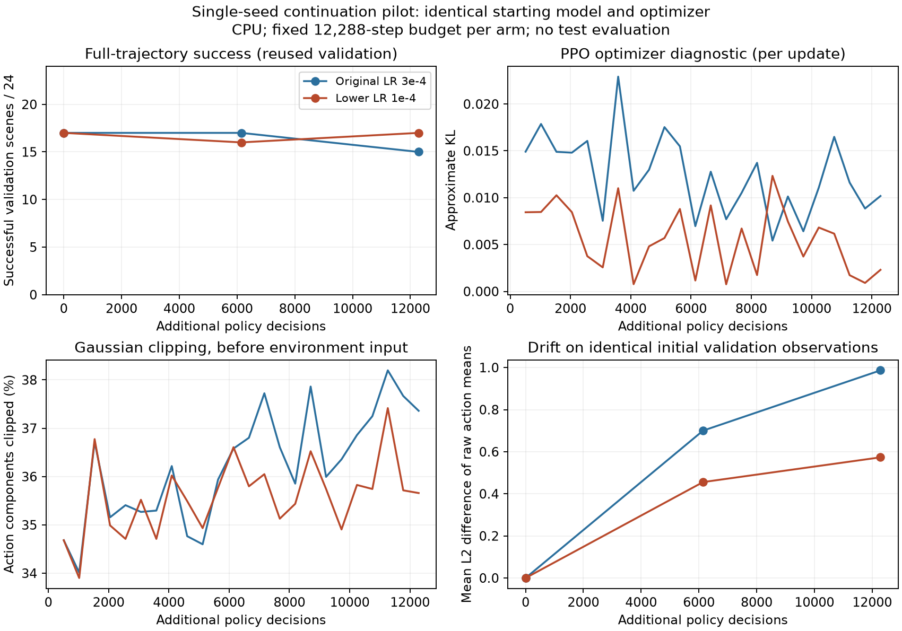

# Learning-rate continuation diagnostic — exploratory addendum

2026-10-09. The released study, its selected models and its test results are unchanged. This local experiment uses only the existing 64 training and 24 validation scenes. It is not a new held-out comparison, a convergence claim or a replacement final report.

## Question and controlled comparison

Would reducing the optimizer learning rate from 3e-4 to 1e-4 reduce policy drift and preserve validation success during short continuation? The plan was saved before training in [learning_rate_diagnostic_v1.json](../configs/learning_rate_diagnostic_v1.json). Both arms start from the same previously selected seed-145 checkpoint, including its optimizer state. They use the same continuation seed (9145), architecture, reward, action scaling, environment, motor limits, 512-decision rollouts and ten optimizer epochs per rollout. Learning rate is the only intended intervention.

Each arm receives exactly 12,288 additional policy decisions. Validation runs after the optimizer updates at 6,144 and 12,288 decisions; the final endpoint is the declared primary comparison. No intermediate checkpoint is selected. The environment and random generators are restarted identically for the two arms. This is a paired continuation experiment, **not an exact resumption of the original historical run**, whose simulator and random-generator state were not saved in the checkpoint.

Initial policy and optimizer fingerprints match. All six stored arrays in the first training rollout match exactly: observations, raw actions, rewards, returns, advantages and episode-start flags. Later trajectories may diverge because different updates change the policy. Validation preserves Python, NumPy and Torch random-generator states and does not update normalization.

## Observed results

Every success count below has the same 24 validation scenes as its denominator. All failures are retained.

| Validation endpoint | Common starting model | Original LR 3e-4 | Lower LR 1e-4 |
| --- | ---: | ---: | ---: |
| Initial successes | 17/24 | — | — |
| Successes after 6,144 additional decisions | — | 17/24 | 16/24 |
| Successes after 12,288 additional decisions | — | 15/24 | 17/24 |
| Final simple-layout successes | 9/12 | 7/12 | 8/12 |
| Final tight-layout successes | 8/12 | 8/12 | 9/12 |
| Collision failures | 7 | 9 | 7 |
| Joint-limit failures | 0 | 0 | 0 |

At the final endpoint, 14 scenes succeed under both continued policies, three only under the lower rate, one only under the original rate, and six under neither. The lower-rate endpoint therefore gains two successes relative to the original-rate endpoint. It does **not** improve the starting model's aggregate count: relative to the start, it gains one scene and loses one. This is not preservation of every initially successful scene.

| Diagnostic | Original LR | Lower LR |
| --- | ---: | ---: |
| Mean per-update approximate KL | 0.01240 | 0.00558 |
| Mean PPO ratio clipping fraction | 10.23% | 2.91% |
| Mean raw Gaussian action components clipped to bounds during training | 36.22% | 35.59% |
| Mean L2 drift of raw action means on a common observation set | 0.9866 | 0.5733 |

The common probe contains 4,803 observations visited by the starting policy on validation. Policy drift is measured in normalized action coordinates, before clipping; it is not a joint-angle distance or a safety margin. Neither endpoint's deterministic raw mean exceeds the action bounds on that probe or on its own validation visits. Raw sampled Gaussian action clipping during stochastic training is distinct from final motor-speed saturation; these quantities must not be conflated.



Lower learning rate reduced measured update/drift diagnostics in this run and preserved the aggregate starting success count. The observation is compatible with the proposed hypothesis, but does not establish the cause of the earlier long-run degradation or show that more training will help. Both endpoints still fail seven or more scenes. There is one continuation seed and a reused selection validation set, so the two-scene difference is exploratory, without an independent generalization estimate. It does not demonstrate superiority over APF. The old 500-episode comparison remains the formal study result.

## Cost and verification

The initial validation and both continuation arms took about **268.5 seconds (4.48 minutes)** in total, excluding setup/load overhead. Training throughput excluding callback validation was approximately 170 and 149 decisions/s. This timing includes training environment features, control, physics, optimization and diagnostic I/O; it is not network-inference latency. The two arms ran sequentially; throughput differences are not attributed to learning rate.

Both endpoint checkpoints were saved and reloaded. Deterministic actions match exactly on all 4,803 common probe observations. There were 120 validation episodes across the five evaluations, all repeats of the same 24 scenes, not 120 independent held-out samples. All 29 directly protected pilot inputs and the broader 1,265-file historical/archive set retain their recorded hashes. The complete risk-test suite passed: **128 tests, 7.97 seconds**.

Evidence: [plan and run summary](../deliverables/updates_v1.2.0/learning_rate_summary.json), [paired analysis](../deliverables/updates_v1.2.0/paired_analysis.json), [engineering verification](../deliverables/updates_v1.2.0/verification_summary.json). The run also contains all validation episode records and physical traces, initial fingerprints, the first training buffers, per-update diagnostics, endpoint models and the source/dependency snapshot. The first plot had an overlong clipped axis label; `analysis_v2` corrects the label and was visually inspected. The earlier plot is preserved.

Reproduce locally (each training run creates a new evidence directory):

```bash
env -u PYTHONPATH OMP_NUM_THREADS=1 OPENBLAS_NUM_THREADS=1 MPLCONFIGDIR=/tmp/panda-local-mpl \
  .venv/bin/python scripts/pilot_learning_rate.py

# Substitute the new run directory printed by the command above.
env -u PYTHONPATH MPLCONFIGDIR=/tmp/panda-local-mpl \
  .venv/bin/python scripts/analyze_learning_rate.py --run experiments/NEW_RUN
```

## 中文解读与下一步

这轮不是“RL 已经变强了”。降低学习率让这次更新更温和，最终成功数为 17/24，高于原学习率继续训练后的 15/24，但仍等于起点；而且中间检查点只有 16/24，并非单调改善。不能从这个单 seed 短实验推出“历史退化就是学习率导致”或“再训练更久就能超过势场”。

新增诊断把三种容易混淆的裁剪分开：PPO 概率比裁剪、随机策略动作边界裁剪、最终电机命令速度限幅。前两种出现并不等同于物理电机饱和；训练时约 36% 的原始 Gaussian 动作分量超界，也不是本实验已经证实的失败原因。

下一优先级是在预先固定预算下复核这一趋势是否跨 continuation seed 重复，再决定是否投入三组从头训练；这些续训 seed 不能冒充独立从头训练 seed。若进一步考察探索方差/熵系数，应另立单因素实验，不同时改奖励、学习率和动作尺度。任何新泛化结论仍需方案冻结后的新未见测试集。目前没有自动扩充预算、替换原模型、访问 GitHub 或提交课程平台。

Publication note: This addendum and its public evidence previews are distributed in v1.2.0. Full raw records and checkpoints are included in that release’s reproduction ZIP. Publication does not promote either exploratory endpoint to the official selected model.
